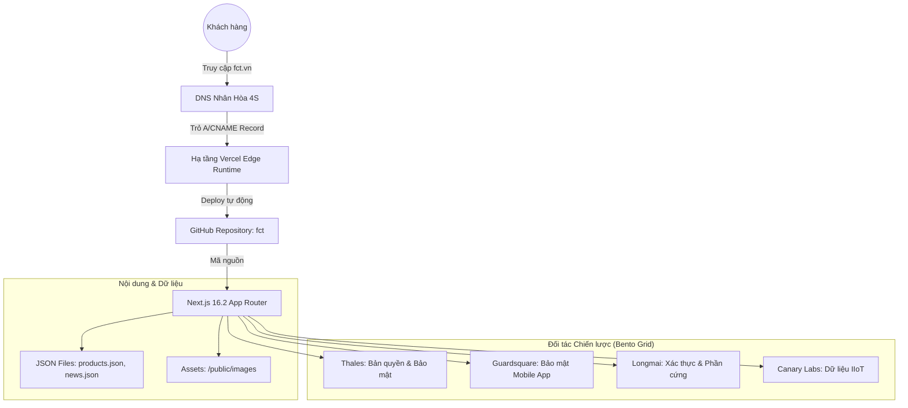

# Sơ đồ Kiến trúc & Giải pháp Website FCT Vĩnh Thịnh

Tài liệu này tổng hợp các giải pháp công nghệ và cấu trúc hạ tầng được sử dụng trong dự án website **fct.vn**.

## 1. Sơ đồ Tổng quan

## 2. Công nghệ sử dụng (Tech Stack)
- **Framework:** [Next.js](https://nextjs.org/) (App Router) - Tối ưu SEO và hiệu suất tải trang cực nhanh.
- **Styling:** [Tailwind CSS](https://tailwindcss.com/) - Thiết kế giao diện hiện đại, responsive.
- **Animation:** [Framer Motion](https://www.framer.com/motion/) - Tạo các hiệu ứng chuyển động mượt mà khi hover và scroll.
- **Icons:** [Lucide React](https://lucide.dev/) - Bộ icon vector sắc nét, đồng bộ.
- **Deployment:** [Vercel](https://vercel.com/) tích hợp CI/CD với GitHub.

## 3. Cấu trúc Giải pháp trên Trang chủ
Cấu trúc trang chủ được thiết kế theo xu hướng **Bento Grid Layout**, giúp phân bổ không gian cho các thương hiệu chính một cách cân bằng:
- **Guardsquare:** Bảo mật ứng dụng di động (DexGuard, iXGuard).
- **Thales:** Quản lý bản quyền phần mềm (Sentinel LDK/EMS).
- **Longmai:** Xác thực 2 lớp và khóa cứng (SmartX, TimePro).
- **Canary Labs:** Hệ thống lưu trữ và phân tích dữ liệu công nghiệp.

## 4. Quản lý Nội dung
Thay vì sử dụng các hệ thống quản trị (CMS) phức tạp, website được tối ưu theo hướng **Headless Data**:
- **Sản phẩm:** Lưu tại `src/data/products.json`. Việc thêm/sửa sản phẩm chỉ cần cập nhật file này.
- **Tin tức:** Lưu tại `src/data/news.json`. Dữ liệu được trích xuất từ các bài viết cũ của fct.vn để đảm bảo tính kế thừa.

## 5. Quy trình Cập nhật (Workflow)
1. **Thay đổi:** Thực hiện sửa code hoặc cập nhật ảnh tại máy cục bộ (**Local**).
2. **Đồng bộ:** Sử dụng lệnh `git add`, `git commit` và `git push` để đẩy lên **GitHub**.
3. **Triển khai:** **Vercel** tự động nhận biết thay đổi và cập nhật trang web sống trong vòng 1-2 phút.

---
*Ghi chú: Tài liệu này được tạo vào ngày 18/04/2026 bởi Antigravity AI Assistant.*
